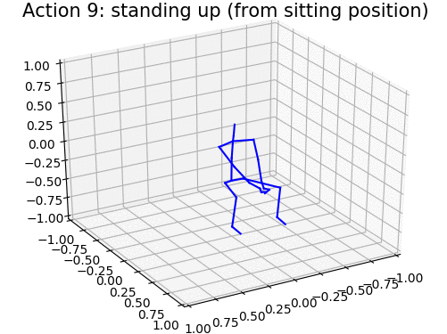
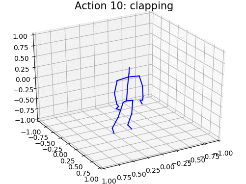
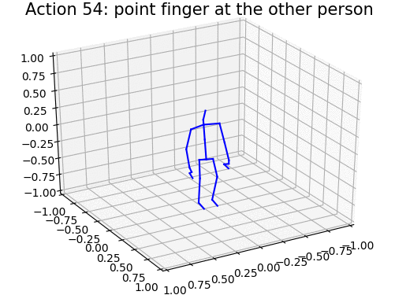
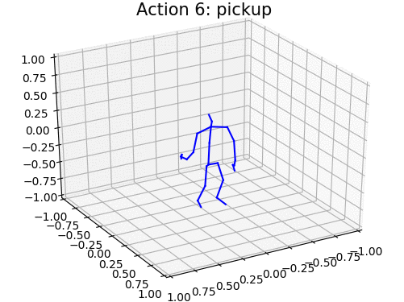
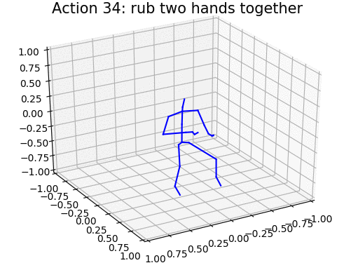
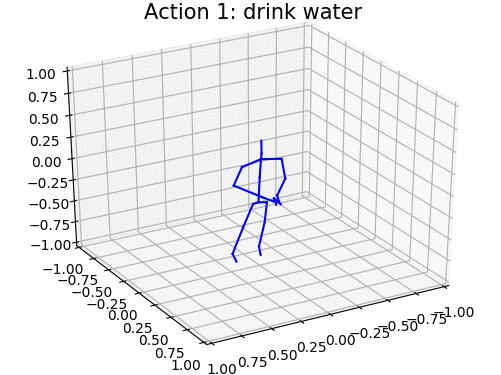
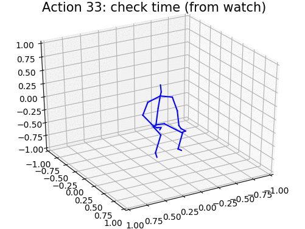

# MS-G3D

PyTorch implementation of "Disentangling and Unifying Graph Convolutions for Skeleton-Based Action Recognition", CVPR 2020 Oral.

[[PDF](https://arxiv.org/pdf/2003.14111.pdf)][[Demo](https://youtu.be/5TcHIIece38)][[Abstract/Supp](https://openaccess.thecvf.com/content_CVPR_2020/html/Liu_Disentangling_and_Unifying_Graph_Convolutions_for_Skeleton-Based_Action_Recognition_CVPR_2020_paper.html)]











## Dependencies

- Python >= 3.6
- PyTorch >= 1.2.0
- [NVIDIA Apex](https://github.com/NVIDIA/apex) (auto mixed precision training)
- PyYAML, tqdm, tensorboardX

## Data Preparation

*Disk usage warning: after preprocessing, the total sizes of datasets are around 38GB, 77GB, 63GB for NTU RGB+D 60, NTU RGB+D 120, and Kinetics 400, respectively. The raw/intermediate sizes may be larger.*

### Download Datasets

There are 3 datasets to download:

- NTU RGB+D 60 Skeleton
- NTU RGB+D 120 Skeleton
- Kinetics 400 Skeleton

#### NTU RGB+D 60 and 120

1. Request dataset here: http://rose1.ntu.edu.sg/Datasets/actionRecognition.asp

2. Download the skeleton-only datasets:
    - `nturgbd_skeletons_s001_to_s017.zip`  (NTU RGB+D 60)
    - `nturgbd_skeletons_s018_to_s032.zip`  (NTU RGB+D 120, on top of NTU RGB+D 60)
    - Total size should be 5.8GB + 4.5GB.

3. Download missing skeletons lookup files [from the authors' GitHub repo](https://github.com/shahroudy/NTURGB-D#samples-with-missing-skeletons):
    - NTU RGB+D 60 Missing Skeletons:
      `wget https://raw.githubusercontent.com/shahroudy/NTURGB-D/master/Matlab/NTU_RGBD_samples_with_missing_skeletons.txt`

    - NTU RGB+D 120 Missing Skeletons:
      `wget https://raw.githubusercontent.com/shahroudy/NTURGB-D/master/Matlab/NTU_RGBD120_samples_with_missing_skeletons.txt`

    - Remember to remove the first few lines of text in these files!

#### Kinetics Skeleton 400

1. Download dataset from ST-GCN repo: https://github.com/yysijie/st-gcn/blob/master/OLD_README.md#kinetics-skeleton
2. [This](https://silicondales.com/tutorials/g-suite/how-to-wget-files-from-google-drive/) might be useful if you want to `wget` the dataset from Google Drive

### Data Preprocessing

#### Directory Structure

Put downloaded data into the following directory structure:

```
- data/
  - kinetics_raw/
    - kinetics_train/
      ...
    - kinetics_val/
      ...
    - kinetics_train_label.json
    - keintics_val_label.json
  - nturgbd_raw/
    - nturgb+d_skeletons/     # from `nturgbd_skeletons_s001_to_s017.zip`
      ...
    - nturgb+d_skeletons120/  # from `nturgbd_skeletons_s018_to_s032.zip`
      ...
    - NTU_RGBD_samples_with_missing_skeletons.txt
    - NTU_RGBD120_samples_with_missing_skeletons.txt
```

#### Generating Data

1. NTU RGB+D
    - `cd data_gen`
    - `python3 ntu_gendata.py`
    - `python3 ntu120_gendata.py`
    - Time estimate is ~ 3hrs to generate NTU 120 on a single core (feel free to parallelize the code :))

2. Kinetics
    - `python3 kinetics_gendata.py`
    - ~ 70 mins to generate Kinetics data

3. Generate the bone data with:
    - `python gen_bone_data.py --dataset ntu`
    - `python gen_bone_data.py --dataset ntu120`
    - `python gen_bone_data.py --dataset kinetics`

## Pretrained Models

- Download pretrained models for producing the final results on NTU RGB+D 60, NTU RGB+D 120, Kinetics Skeleton 400: [[Dropbox](https://www.dropbox.com/s/9n9897cu1ft1khg/msg3d-pretrained-models.zip)][[GoogleDrive](https://drive.google.com/open?id=1y3VbEnINtyriy82apiTZJtBV1a3cywa-)][[WeiYun](https://share.weiyun.com/DlR4Jse1)]


- Put the folder of pretrained models at repo root:

```
- MS-G3D/
  - pretrained-models/
  - main.py
  - ...
```

- Run `bash eval_pretrained.sh`


## Training & Testing

- The general training template command:
```
python3 main.py
  --config <config file>
  --work-dir <place to keep things (weights, checkpoints, logs)>
  --device <GPU IDs to use>
  --half   # Mixed precision training with NVIDIA Apex (default O1) for GPUs ~11GB memory
  [--base-lr <base learning rate>]
  [--batch-size <batch size>]
  [--weight-decay <weight decay>]
  [--forward-batch-size <batch size during forward pass, useful if using only 1 GPU>]
  [--eval-start <which epoch to start evaluating the model>]
```

- The general testing template command:
```
python3 main.py
  --config <config file>
  --work-dir <place to keep things>
  --device <GPU IDs to use>
  --weights <path to model weights>
  [--test-batch-size <...>]
```

- Template for joint-bone two-stream fusion:
```
python3 ensemble.py
  --dataset <dataset to ensemble, e.g. ntu120/xsub>
  --joint-dir <work_dir of your test command for joint model>
  --bone-dir <work_dir of your test command for bone model>
```

- Use the corresponding config files from `./config` to train/test different datasets

- Examples
  - Train on NTU 120 XSub Joint
    - Train with 1 GPU:
      - `python3 main.py --config ./config/nturgbd120-cross-subject/train_joint.yaml`
    - Train with 2 GPUs:
      - `python3 main.py --config ./config/nturgbd120-cross-subject/train_joint.yaml --batch-size 32 --forward-batch-size 32 --device 0 1`
  - Test on NTU 120 XSet Bone
    - `python3 main.py --config ./config/nturgbd120-cross-setup/test_bone.yaml`
  - Batch size 32 on 1 GPU (BS 16 per forward pass by accumulating gradients):
    - `python3 main.py --config <...> --batch-size 32 --forward-batch-size 16 --device 0`

- Resume training from checkpoint
```
python3 main.py
  ...  # Same params as before
  --start-epoch <0 indexed epoch>
  --weights <weights in work_dir>
  --checkpoint <checkpoint in work_dir>
```


## Notes

- It's recommended to linearly scale up base LR with > 2 GPUs (https://arxiv.org/pdf/1706.02677.pdf, Section 2.1) to use 16 samples per worker during training; e.g.
  - 1 GPU: `--base-lr 0.05 --device 0 --batch-size 32 --forward-batch-size 16`
  - 2 GPUs: `--base-lr 0.05 --device 0 1 --batch-size 32 --forward-batch-size 32`
  - 4 GPUs: `--base-lr 0.1 --device 0 1 2 3 --batch-size 64 --forward-batch-size 64`

- Unfortunately, different PyTorch/CUDA versions & GPU setups can cause different levels of memory usage, and so you may experience out of memory (OOM) on some machines but not others
  - 1080Ti GPUs with `--half` and `--amp-opt-level 1` (default) are relatively more stable

- If OOM occurs, try using Apex O2 by setting `--amp-opt-level 2`. However, note that
  - NVIDIA Apex does not yet support `nn.DataParallel` for O2
    - https://github.com/NVIDIA/apex/issues/227#issuecomment-566843218
    - This means you may need to train on a single GPU when using O2
  - It may also impact the stability of training and/or the final performance

- Default hyperparameters are stored in the config files; you can tune them & add extra training techniques to boost performance

- The best joint-bone fusion result may not come from the best single stream models; for example, we provided 3 pretrained models for NTU RGB+D 60 XSub joint stream where the best fusion performance comes from the slightly underperforming model (~89.3%) instead of the reported (~89.4%) and the slightly better retrained model (~89.6%).


## Acknowledgements

This repo is based on
  - [2s-AGCN](https://github.com/lshiwjx/2s-AGCN)
  - [ST-GCN](https://github.com/yysijie/st-gcn)

Thanks to the original authors for their work!


## Citation

Please cite this work if you find it useful:

```
@inproceedings{liu2020disentangling,
  title={Disentangling and Unifying Graph Convolutions for Skeleton-Based Action Recognition},
  author={Liu, Ziyu and Zhang, Hongwen and Chen, Zhenghao and Wang, Zhiyong and Ouyang, Wanli},
  booktitle={Proceedings of the IEEE/CVF Conference on Computer Vision and Pattern Recognition},
  pages={143--152},
  year={2020}
}
```


## Contact
Please email `kenziyuliu AT outlook.com` for further questions
